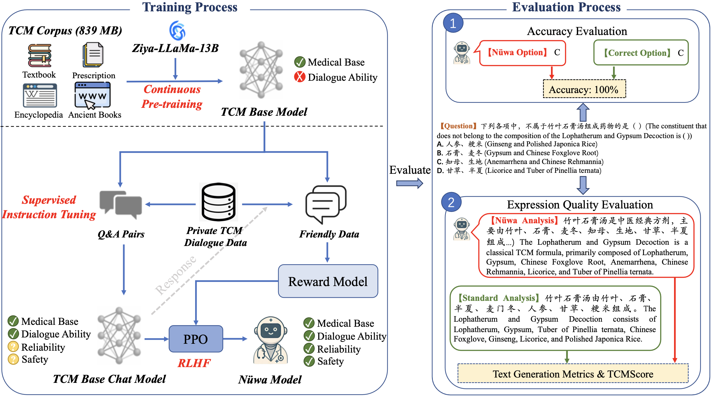

    
    <h3 style="font-size: 50pt;" align=center><strong>Nüwa</strong></h2>
  </a>

<h2 style="font-size: 50pt;" align=center><strong>Towards Large Language Model to Be a Traditional Chinese Medicine Doctor</strong></h2>

### 📖 Introduction
we introduce Nüwa, a comprehensive Traditional Chinese Medicine LLM that encompasses the entire training pipeline from Continuous Pre-training and Supervised Instruction Fine-tuning to Reinforcement Learning from AI Feedback. Nuwa outperforms other open-source Chinese medical LLMs within TCM domain, thanks in part to our construction of a large-scale TCM training corpus and TCM dialogue dataset.

### 🔥 News and Updates

✅ [2024/08/15] Nüwa starts releasing dataset, code, etc.

✅ [2024/08/01] Nüwa TCM repo is created.

### 📚 Data

- `data/pretrain`: Contains part of TCM corpus for continuous pre-training the model.

- `data/finetune`: Contains part of TCM-QR for supervised instruction fine-tuning the model.

- `data/reward`: Contains samples for training the reward model.

### ⭐ Code Structure

### ⚙️ Getting Started

### 🐌 Quick Start

