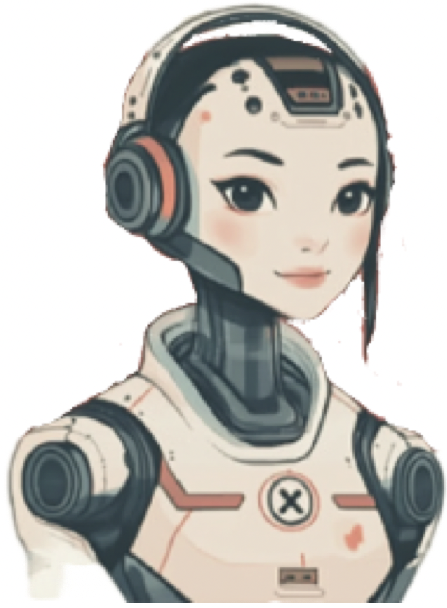
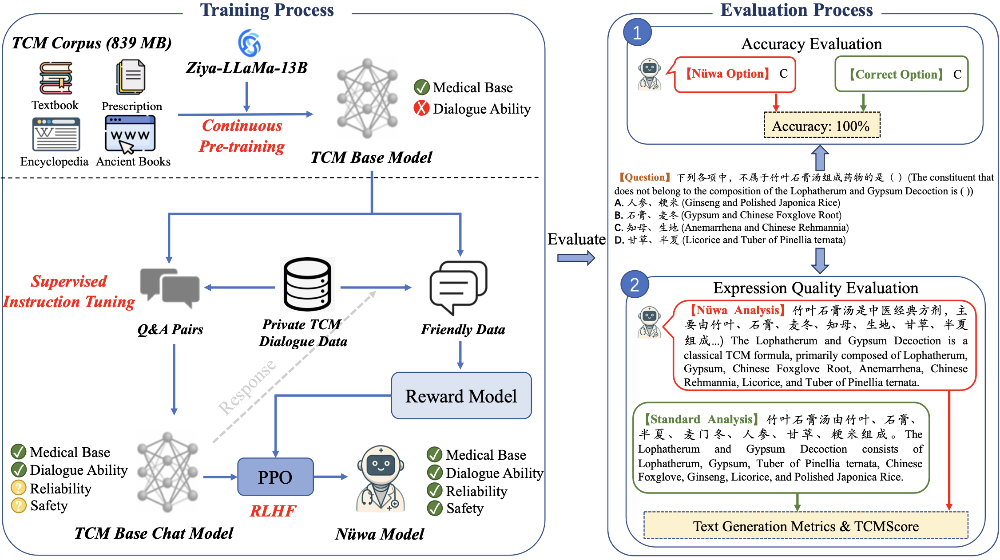

<div align="center">
    
  </a>
</div>

<div align=center>
<h2 style="font-size: 30pt;" align=center><strong>Nüwa: Towards Large Language Model to Be a Traditional Chinese Medicine Doctor</strong></h2>
</div>

### 📖 Introduction
We introduce Nüwa, a comprehensive Traditional Chinese Medicine LLM that encompasses the entire training pipeline from Continuous Pre-training and Supervised Instruction Fine-tuning to Reinforcement Learning from AI Feedback. Nuwa outperforms other open-source Chinese medical LLMs within TCM domain, thanks in part to our construction of a large-scale TCM training corpus and TCM dialogue dataset.

<div align="center">

</div>

### 🔥 News and Updates

✅ [2025/04/05] Nüwa starts releasing dataset, code, etc.

✅ [2025/04/01] Nüwa TCM repo is created.

### 📚 Data

- `data/pretrain`: Contains part of TCM corpus for continuous pre-training the model.

- `data/finetune`: Contains part of TCM-QR for supervised instruction fine-tuning the model.

- `data/reward`: Contains samples for training the reward model.

### ⭐ Code Structure
Training Stage:

| Stage                            |  Python script                                                                                                           | Shell script                                                                        |                      
|:--------------------------------|:------------------------------------------------------------------------------------------------------------------------|:------------------------------------------------------------------------------------|
| Stage 1: Continue Pre-training   |  pretraining.py                     | run_pt.sh   | 
| Stage 2: Supervised Instruction Fine-tuning | supervised_finetuning.py | run_sft.sh  | 
| Stage 3: Reward Modeling        | reward_modeling.py                  | run_rm.sh   | 
| Stage 4: Reinforcement Learning |  rl_training.py                      | run_rl.sh| 


### 🐌 Quick Start

#### 👉 Environment Setup
- To install the required packages, you can create a conda environment.

```sh
conda create --name nvwa-tcm python=3.8
```

- Activate conda environment.

```sh
conda activate nvwa-tcm
```

- Use pip to install required packages.

```sh
pip install -r requirements.txt
```

#### 👉 Download base model

- Please download the LLaMA-Ziya-13B model from the link [Download Link](https://huggingface.co/IDEA-CCNL/Ziya-LLaMA-13B-v1).


#### 👉 Training

- 1. Continuous Pre-training

```sh
bash run_pt.sh
```

- 2. Supervised Instruction Fine-tuning

```sh
bash run_sft.sh
```

The LoRA method is used here, and the parameters need to be merged into the Model

```sh
python merge_peft_adapter.py
```

- 3. Reward Modeling
 
```sh
bash run_rm.sh
```

- 4. Reward Modeling
 
```sh
run_rl.sh
```

#### 👉 Inference

```sh
python inference.py
```


